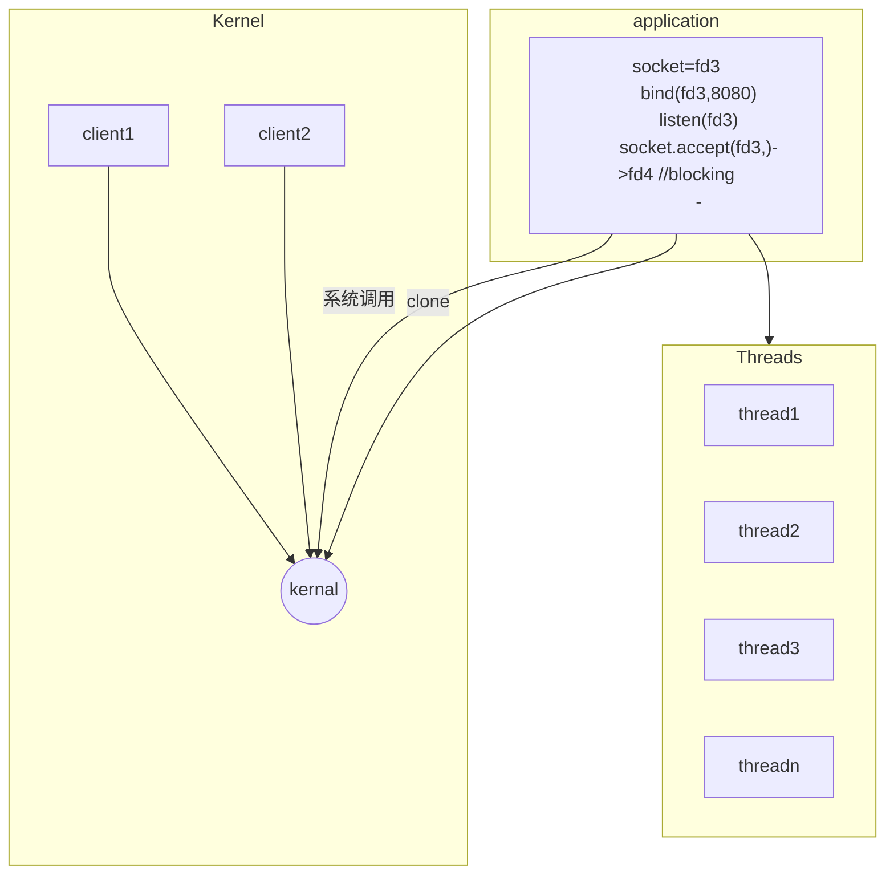
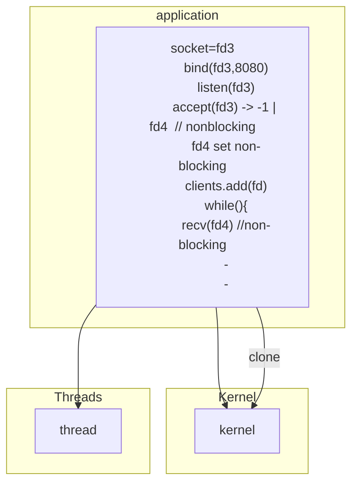
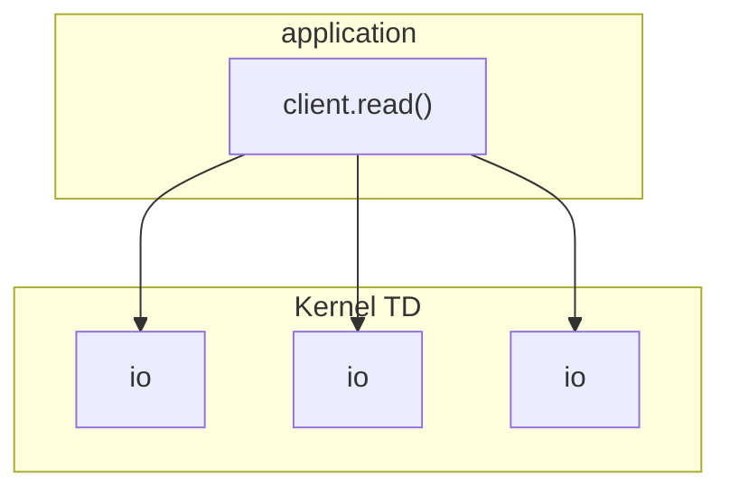
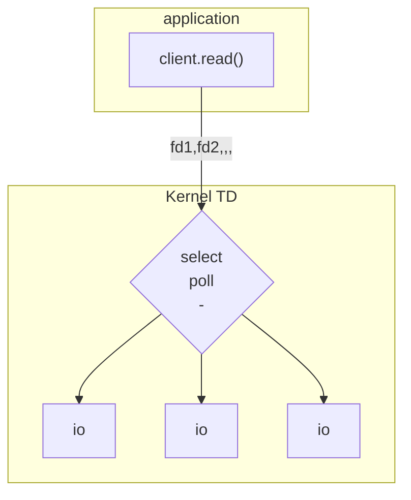
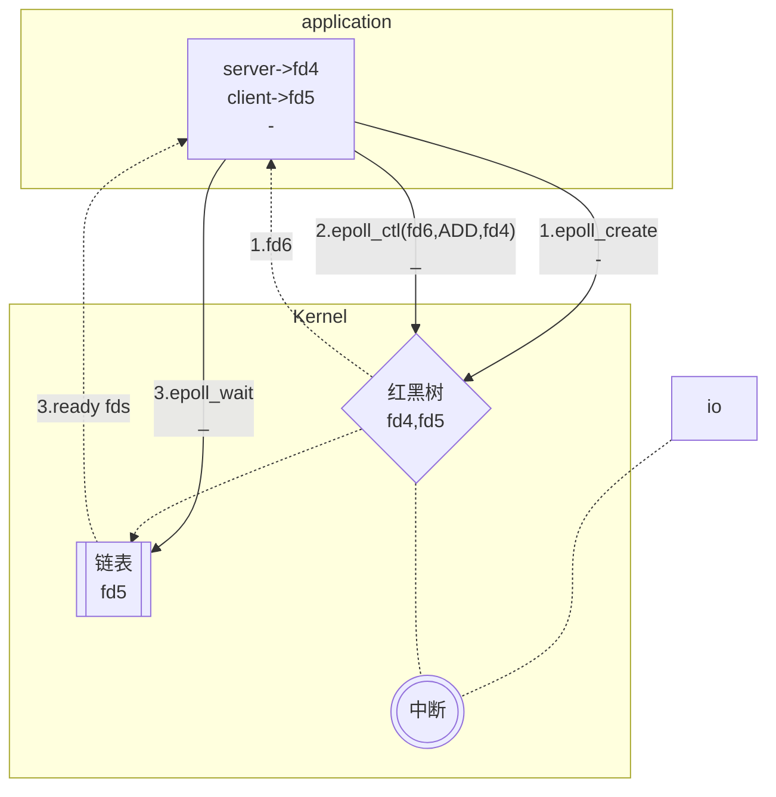

# IO model

<!--Writerside adds this topic when you create a new documentation project.
You can use it as a sandbox to play with Writerside features, and remove it from the TOC when you don't need it anymore.-->

## BIO
BIO模型

### BIO的问题 {id="bio_1"}
socket.accept()方法是阻塞的，因为accept是阻塞的，所以每个客户端连接，都需要调用内核clone方法去创建一个线程去处理，并且每个线程内部，
read()系统调用也是阻塞的，随着客户端连接数的增加（C10K问题），线程之间切换的成本也随之增大，造成服务器处理请求效率迅速下降。

## NIO {id="nio_2"}
为了解决因BIO模型accept阻塞而不得不创建大量线程的缺点，NIO模型应运而生。linux系统中，通过调用系统内核提供的方法，设置socket为非阻塞。
从而应用程序有机会实现一个或者几个线程来处理大量客户端连接，降低线程切换的系统开销。
NIO模型：

### NIO的问题
随着连接数量的增大(C10K)，每循环一次，都要进行O(n)复杂度的系统调用recv（即调用read方法读取连接数据）来遍历每个连接的数据，
而这其中必然很多都是无意义的、浪费的。

## 多路复用

### NIO中的问题 {id="nio_1"}
NIO模型中，调用client.read()方法进行内核recv读取连接数据，应用程序需要向内核发起n次调用：

### 多路复用模型
为了解决NIO模型中每循环recv复杂度O(n)的问题，内核中引入了多路复用的IO模型。所谓的**路**就是指IO，多路复用就是一次用户态内核态的切换，
查询多条"路“的状态。

#### select,poll模型

select，poll模型的优势就是虽然也需要遍历所有的IO，但是NIO这个遍历成本是在用户态和内核态的切换上。而多路复用模型的这个遍历过程指经历了一次系统
调用，调用过程中，应用程序把fds数组传给内核，在内核中遍历io，修改fds的状态。

select,poll的缺点是仍然发生了全量fds的遍历，在内核中是O(n)的复杂度，其中必然也有大量的无用调用。

#### epoll模型
为了弥补select，poll模型的缺点，多路复用模型引入了epoll模型。

在基于epoll机制的多路复用的java程序中，调用`Selector.open()`方法就相当于java调用内核中的epoll_create来创建一个Selector对象，这个Selector对象
就是多路复用器在java程序中的抽象,此时会在内存中开辟两个空间，一个*红黑树*一个*链表*。

调用`SelectableChannel.register()`方法就是调用内核的epoll_ctl方法**向红黑树中注册代表socket的文件描述符**。

调用`Selector.select()`方法就是向内核调用epoll_wait()，一次性返回链表中有状态的文件描述符。

注意，依赖于底层中断机制，如果io中有数据进来，就会触发内核中的回调事件，即红黑树将代表该io socket的文件描述符同步到链表中。

这样，无论在程序中还是在内核中，都避免了对文件描述符的遍历过程。